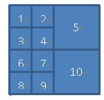
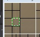

<!-- 
.. link: 
.. description: 
.. tags: HEVC,Video Coding,CU
.. date: 2012/12/16 20:36:15
.. title: HEVC学习之CU划分小实验
.. slug: HEVC-basic-CU-learning
-->

HEVC的CU的概念相信每个搞HEVC的童鞋都很清楚，但是怎么才能让HEVC的CU划分更加直观的表现出来呢，每次调试程序我的心中都有着下面这幅图，可是，我想把它直观的表现出来！谁叫咱智商不行，还是个没有用的程序猿，以后也毕不了业，也找不到工作呢！


好了，废话不多说，咱们不搞理论的，没有太多废话！基于HM 9.0

要想实际的打出CU划分的最终结果，我想了一个办法，就是修改HEVC的decoder，在CU最终划分的结果的地方把像素换成一个特殊值，比如luma改成0，就变成黑色的了。

怎么改呢，我代码才看了没多久，只好先研究一下decoder：

作为屌丝程序员，上来俺就找decoder的main函数，俺知道main函数里面这句话是关键：

```CPP
// call decoding function
cTAppDecTop.decode();
```

不多说，进去，在TAppDecTop::decode()函数里面俺知道这一句也是关键：

```CPP
bNewPicture = m_cTDecTop.decode(nalu, m_iSkipFrame, m_iPOCLastDisplay);
```

不多说，进去，然后就豁然了一下，下面是一个对nalu.m_nalUnitType switch的语句，是对不同的nal分别解码，我要管的不是pps也不是sps就直接看解码一个slice：

```CPP
return xDecodeSlice(nalu, iSkipFrame, iPOCLastDisplay);
```

xDecodeSlice这个函数比较长，不过我就看上了一句话，这个函数的结尾部分：

```CPP
//  Decode a picture
m_cGopDecoder.decompressSlice(nalu.m_Bitstream, pcPic);
```

TDecGop::decompressSlice(TComInputBitstream*pcBitstream, TComPic*& rpcPic)这个函数俺也就看上一句话：

```CPP
m_pcSliceDecoder->decompressSlice( pcBitstream, ppcSubstreams, rpcPic, m_pcSbacDecoder, m_pcSbacDecoders);
```

这个函数很关键，里面有这样的一个大循环：

```CPP
for( Int iCUAddr = iStartCUAddr; !uiIsLast && iCUAddr < rpcPic->getNumCUsInFrame(); iCUAddr = rpcPic->getPicSym()->xCalculateNxtCUAddr(iCUAddr) )
  {/*循环里面的代码*/}
```

看到这个地方你想到了啥呢，没错，这是对LCU一个个循环的地方，在这个循环里面调用了m_pcCuDecoder->decodeCU( pcCU, uiIsLast ); decodeCU就是对一个LCU进行解码，到decodeCU里面看一看，发现他调用了xDecodeCU，而xDecodeCU是一个递归函数，是分别解码各个最终划分的CU，xDecodeCU里面有一个是否要一分为四的判断：

```CPP
if( ( ( uiDepth < pcCU->getDepth( uiAbsPartIdx ) ) && ( uiDepth < g_uiMaxCUDepth - g_uiAddCUDepth ) ) || bBoundary )
```

如果条件不满足，不就说明到达最终的CU的划分的地方了吗，好，在if出来的地方填上这样的一句话：

```CPP
std::cout<<"uiLPelX uiTPelY uiRPelX uiBPelY "<<uiLPelX<<" "<<uiTPelY<<" "<<uiRPelX<<" "<<uiBPelY<<std::endl;
```

运行解码器，解码一个I帧，输出的部分结果如下：

	uiLPelX uiTPelY uiRPelX uiBPelY 0 0 15 15
	uiLPelX uiTPelY uiRPelX uiBPelY 16 0 31 15
	uiLPelX uiTPelY uiRPelX uiBPelY 0 16 15 31
	uiLPelX uiTPelY uiRPelX uiBPelY 16 16 31 31
	uiLPelX uiTPelY uiRPelX uiBPelY 32 0 63 31
	uiLPelX uiTPelY uiRPelX uiBPelY 0 32 15 47
	uiLPelX uiTPelY uiRPelX uiBPelY 16 32 31 47
	uiLPelX uiTPelY uiRPelX uiBPelY 0 48 15 63
	uiLPelX uiTPelY uiRPelX uiBPelY 16 48 31 63
	uiLPelX uiTPelY uiRPelX uiBPelY 32 32 63 63

可以明显看出这一个CU的划分是如下结果：



于是我就想个办法把每个小块的的两个坐标点存下来不就好了吗，于是在typedef.h我添加了如下代码：

```CPP
//cheng 
struct PtPair
{
  UInt _pt1x;
  UInt _pt1y;
  UInt _pt2x;
  UInt _pt2y;
};
```
定义一个struct，保存一组坐标。在class TDecSlice里面添加一个私有成员：

```CPP
std::vector<PtPair> m_listLastCU
```

用来保存一个slice里面所有的最终CU的划分结果

修改TDecCu::decodeCU的函数参数，把在class TDecSlice里面的m_listLastCU传递过去：

```CPP
Void TDecCu::decodeCU( TComDataCU* pcCU, UInt& ruiIsLast, std::vector<PtPair>& list )
```

调用改为：

```CPP
m_pcCuDecoder->decodeCU     ( pcCU, uiIsLast, m_listLastCU );
```

classTDecCu也添加一个私有成员用来保存class TDecSlice传递过来的vector的指针：

```CPP
std::vector<PtPair>* m_plistPt;
```

Void TDecCu::decodeCU( TComDataCU* pcCU,UInt& ruiIsLast, std::vector<PtPair>& list )函数里面开头部分添加：

```CPP
m_plistPt = &list;
```

decodeCU函数变成如下结果：

```CPP
Void TDecCu::decodeCU( TComDataCU* pcCU, UInt& ruiIsLast, std::vector<PtPair>& list )
{
  //cheng
  m_plistPt = &list;
  //
  if ( pcCU->getSlice()->getPPS()->getUseDQP() )
  {
    setdQPFlag(true);
  }
                              
#if !REMOVE_BURST_IPCM
  pcCU->setNumSucIPCM(0);
#endif
                              
  // start from the top level CU
  xDecodeCU( pcCU, 0, 0, ruiIsLast);
}
```

在TDecCu::xDecodeCU( TComDataCU* pcCU, UInt uiAbsPartIdx, UIntuiDepth, UInt& ruiIsLast)这个函数里面的打印坐标信息的那一句话后面添加上：

```CPP
  pt._pt1x = uiLPelX; pt._pt1y = uiTPelY; pt._pt2x = uiRPelX; pt._pt2y = uiBPelY;
  m_plistPt->push_back(pt);
```

这样的话，解码完一帧，m_listLastCU里面就保存了CU最终划分的结果。

TDecSlice::decompressSlice开头需要把vector清空以便于在解码下一帧的时候vector中的信息要重新记录

```CPP
m_listLastCU.clear();
```

最后在TDecSlice::decompressSlice的LCU的for循环的后面添加绘制CU最终边框的代码：

```CPP
  Pel* pY = rpcPic->getPicYuvRec()->getLumaAddr();
  UInt stride = rpcPic->getPicYuvRec()->getStride();
  for(UInt index = 0; index < m_listLastCU.size(); index++)
  {
    for(UInt y = m_listLastCU[index]._pt1y; y <= m_listLastCU[index]._pt2y; y++)
    {
      for(UInt x = m_listLastCU[index]._pt1x; x <= m_listLastCU[index]._pt2x; x++)
      {
        if(y == m_listLastCU[index]._pt1y /*|| y == m_listSCU[index]._pt2y*/)
          pY[y*stride + x] = 0;
        if(x == m_listLastCU[index]._pt1x /*|| x == m_listSCU[index]._pt2x*/)
          pY[y*stride + x] = 0;
      }
    }
  }
```

解码一帧图像使用YUV播放器查看效果：


怎么办呢，在TDecSlice::decompressSlice函数里面添加一个类似的vector记录一下LCU，在class TDecSlice里面再添加一个私有成员std::vector<PtPair>m_listLCU;，TDecSlice::decompressSlice函数开始的地方清空vector：m_listLastCU.clear();

在LCU的大大的for循环里面添加代码记录LCU划分的信息：

```CPP
UInt xpel = pcCU->getCUPelX();
UInt ypel = pcCU->getCUPelY();
UInt width = pcCU->getWidth(0);
UInt height = pcCU->getHeight(0);
//std::cout<<"xpel :"<<xpel<<"ypel :"<<ypel<<"width : "<<width<<"height :"<<height<<std::endl;
PtPair pt;
pt._pt1x = xpel; pt._pt1y = ypel; pt._pt2x = xpel + width; pt._pt2y = ypel + height;
m_listLCU.push_back(pt);
```

然后在刚才的画黑框的代码后面添加LCU的画白框的代码：

```CPP
  for(UInt index = 0; index < m_listLCU.size(); index++)
  {
    for(UInt y = m_listLCU[index]._pt1y; y <= m_listLCU[index]._pt2y; y++)
    {
      for(UInt x = m_listLCU[index]._pt1x; x <= m_listLCU[index]._pt2x; x++)
      {
        if(y == m_listLCU[index]._pt1y /*|| y == m_listLCU[index]._pt2y*/)
          pY[y*stride + x] = 255;
        if(x == m_listLCU[index]._pt1x /*|| x == m_listLCU[index]._pt2x*/)
          pY[y*stride + x] = 255;
      }
    }
  }
```

运行解码器再试一下：


你可以很明显的看到LCU的大白色块！哈哈！

后面其实你可以发现：


和这个一模一样



注：以上画框的结果只能适用于I帧，对于P/B帧，由于解码我修改重建值也就修改了了P/B参考帧的像素值，导致P/B帧画框会出现一定混乱，不过对于P/B帧，vector里面存放的数据应该是对的！