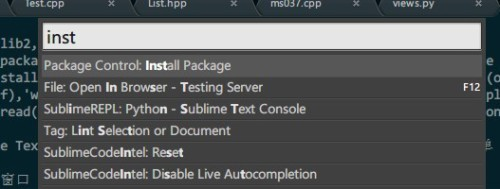
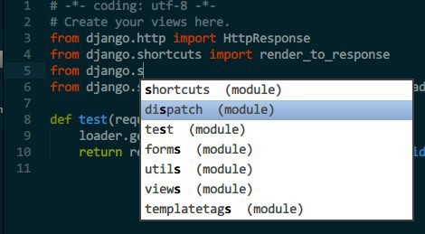

<!-- 
.. link: 
.. description: 
.. tags: Sublime Text 2,Plugin
.. date: 2013/08/18 21:40:02
.. title: Sublime Text 2 使用心得
.. slug: Sublime-Text-2
-->

Sublime Text 2是一款现代轻量级跨平台文本编辑器，他配置比较方便（相对于Vim和Emacs而言），可定制性较强，插件丰富，更难能可贵的是快捷键和chrome差不多（Ctrl + N 新建标签页 Ctrl + W 关闭当前标签页 Ctrl + Shift + T 打开上一次关闭的文件）。

## 概览 ##

主题采用Solarized Dark Color Scheme，侧边栏做过颜色的修饰


## 侧边栏颜色修改 ##

修改此文件%appdata%\Sublime Text 2\Packages\Theme - Default\Default.sublime-theme

有三处地方要修改

```json
{
    "class": "sidebar_tree",
    "row_padding": [8, 3],
    "indent": 12,
    "indent_offset": 17,
    "indent_top_level": false,
    "layer0.tint": [4, 32, 41],
    "layer0.opacity": 1.0,
    "dark_content": false
},
                                               
{
    "class": "sidebar_label",
    "color": [150, 150, 150],
    "font.bold": false
    // , "shadow_color": [250, 250, 250], "shadow_offset": [0, 0]
},
                                               
{
    "class": "sidebar_container",
    "layer0.tint": [10, 10, 10],
    "layer0.opacity": 1.0,
    "layer0.draw_center": false,
    "layer0.inner_margin": [0, 0, 1, 0],
    "content_margin": [0, 0, 1, 0]
},
```

layer0.tint color 是JSON的语法，后面的是RGB颜色值，可以改成你喜欢的颜色，上面的是我自己的配置，效果如下：


## 快速跳转 ##

GotoAnything -> Ctrl + P

这时候会出现这样的子窗口：


你可以在任何当前打开的文件下面自由切换，使用@ 开头可以在当前文件中的函数切换


使用# 可开头可以在当前文件中多有的符号中切换，


使用: 开头加上行号可以在当前的制定行行号切换


## 文件自动保存 ##

在标签页上看到这种叉叉，意味着当前文件是保存过了的，


,但是这种叉叉


意味着当前文件没有被保存，一旦意外文件关闭会怎么办？是关闭之前弹出提示框？No，直接关闭，下次启动Subime Text会还原出上一次使用该文件时候的状态！

## 安装Package Control ##

这是一段Python代码，使用Ctrl + ~ 调出console，复制下面的代码回车，然后重启：

```python
import urllib2,os;
pf='Package Control.sublime-package'; ipp=sublime.installed_packages_path();
os.makedirs(ipp) if not os.path.exists(ipp) else None; urllib2.install_opener(urllib2.build_opener(urllib2.ProxyHandler()));
open(os.path.join(ipp,pf),'wb').write(urllib2.urlopen('http://sublime.wbond.net/'+pf.replace(' ','%20')).read());
print 'Please restart Sublime Text to finish installation'
```

重启Sublime Text之后，查看Preference菜单之下会有一个Package Control的子菜单

## 命令匹配子窗口 ##

输入Ctrl + Shift + P，你会发现如下的子窗口，编辑器的所有的命令都会出现在在各子窗口里面，这里可以进行模糊匹配，输入install，你会看到如下效果：



选中Package Control install package这个子命令，Sublime Text会列出所有的可用的插件集合（Github网络上的），你可以选择喜欢的安装。

## 我推荐的一些插件 ##

Git

这个插件在Subime Text里面直接集成git命令，使用的确很方便，使用Ctrl + Shift + P，输入Git之后你就知道该怎么搞了。


Sublime Code Intel

Python的自动补全很强大



Sublime REPL

可以在Sublime Text里面直接执行脚本


Markdown Preview

直接在浏览器预览Markdown语法的文件