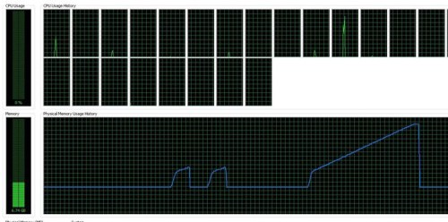

<!-- 
.. link: 
.. description: 
.. tags: 内存泄露,C++,VisualLeak Detector,valgrind
.. date: 2012/11/18 00:31:01
.. title: 内存泄露，我擦
.. slug: oh-memory-leak
-->

在这个快节奏的环境下，男人怕泄，女人怕漏。一个C/C++程序猿怕啥呢——泄露。下面是我从别的地方摘录的一段[1]。

“C/C++编译的程序的内存分配分为以下几个部分：栈区（stack）——由编译器自动分配释放，存放函数的参数值，局部变量的值等。其操作方式类似于数据结构中的栈。堆区（heap）——一般由程序员分配释放，若程序员不释放，程序结束时可能由OS回收。注意它与数据结构中的堆是两回事，分配方式倒是类似于链表。全局区（静态区）（static）——全局变量和静态变量的存储是放在一块的，初始化的全局变量和静态变量在一块区域，未初始化的全局变量和未初始化的静态变量在相邻的另一块区域。程序结束后由系统释放。文字常量区——常量字符串就是放在这里的，程序结束后由系统释放。程序代码区——存放函数体的二进制代码。”

Memory Leak中文翻译为内存泄露，这是一个令人头疼的话题，因为由程序猿手动动态分配的内存一般都在heap上，这个蛋疼的东西总困扰着C/C++程序猿，如果不手动释放该内存，在程序退出之前，这一块内存是不会被释放的。

有人这时候就站出来了，你怎么能这么懒呢，用完释放不就得了吗。我只能说，“猿”非圣贤，咋就不能有个疏忽的地方呢。一旦疏忽就悲剧了，代码逻辑简单的还好，一旦复杂起来，恐怕只有上帝才知道是哪个地方泄露了。都这样了，当然咱们不多说废话了，我来介绍两个专搞内存泄露的工具。

Windows工具——VisualLeak Detector(VLD)，这货是用在Visual Studio上面的，至于如果你使用MingW之类的我还木有研究过。官方网站是：[VisualLeak Detector(VLD)](http://vld.codeplex.com/ "http://vld.codeplex.com/")

下载下来，安装，把安装目录下面的src目录添加到VisualStudio的include path里面，把lib目录添加到Visual Studio的lib path里面，注意有lib目录有两个分别代表的是x86和x64，这要根据你的工程的配置来选择使用哪一个。好了一切就绪了，我们试一把。

首先编写一个非常简单的泄露程序，虽然我在一些面试题目上面看到说这个不算内存泄露。

```CPP
#include <iostream>
					  
int main(int argc, char** argv)
{
	int *p = new int[10];
	return 0;
}
```

使用F5直接调试运行一下，观察output的最后一段：

    WARNING: Visual Leak Detector detected memory leaks!
    ---------- Block 1 at 0x00379580: 40 bytes ----------
      Call Stack:
        e:\projects\leak\leak\source.cpp (6): leak.exe!main + 0x7 bytes
        f:\dd\vctools\crt_bld\self_x86\crt\src\crtexe.c (536): leak.exe!__tmainCRTStartup + 0x19 bytes
        f:\dd\vctools\crt_bld\self_x86\crt\src\crtexe.c (377): leak.exe!mainCRTStartup
        0x765CED6C (File and line number not available): kernel32.dll!BaseThreadInitThunk + 0x12 bytes
        0x77B8377B (File and line number not available): ntdll.dll!RtlInitializeExceptionChain + 0xEF bytes
        0x77B8374E (File and line number not available): ntdll.dll!RtlInitializeExceptionChain + 0xC2 bytes
      Data:
        CD CD CD CD    CD CD CD CD    CD CD CD CD    CD CD CD CD     ........ ........
        CD CD CD CD    CD CD CD CD    CD CD CD CD    CD CD CD CD     ........ ........
        CD CD CD CD    CD CD CD CD                                   ........ ........
                      
                      
    Visual Leak Detector detected 1 memory leak (76 bytes).
    Largest number used: 76 bytes.
    Total allocations: 76 bytes.
    Visual Leak Detector is now exiting.
    The program '[7652] leak.exe' has exited with code 0 (0x0).

这里就很明白了把，这个vld工具可以打印出泄露调用的堆栈，双击任意错误处，可以到达错误的地方，e:\projects\leak\leak\source.cpp (6): leak.exe!main + 0x7 bytes双击这句话就定位到了main函数的第六行。哈哈，很方便吧！

使用Linux的童鞋要鄙视我们了，人家都是命令行的高手，不屑于使用GUI工具，再说也木有Visual Studio，Vim Emacs之类的利器可以秒杀Visual Studio。这时候如何定位泄露的地方呢？现在推出终极杀人魔——valgrind。官网：[valgrind](http://www.valgrind.org "http://www.valgrind.org")

使用debian和ubuntu的童鞋可以使用apt-get命令安装此软件。

首先使用gcc的童鞋首先编译的时候加上-g的debug选项，优化最好是使用-o0，然后如果你的程序运行是使用如下的参数方式：

	myprog arg1 arg2

现在就改成下面的方式：

	valgrind--leak-check=yes myprog arg1 arg2

等到程序结束的时候就可以看到泄露的地方啦。（本人Linux菜鸟，没法给大家演示了，不然又要重启进入Linux或者打开卡卡的虚拟机）

哈哈，到这里了，泄露还是否那么可怕呢。我给大家一张恐怖的泄露截图吧，以供娱乐：



参考资料：

[1] [http://bbs.csdn.net/topics/390050717](http://bbs.csdn.net/topics/390050717)

[2] [http://vld.codeplex.com/documentation](http://vld.codeplex.com/documentation)

[3] [http://www.valgrind.org/docs/manual/quick-start.html#quick-start.mcrun](http://www.valgrind.org/docs/manual/quick-start.html#quick-start.mcrun)