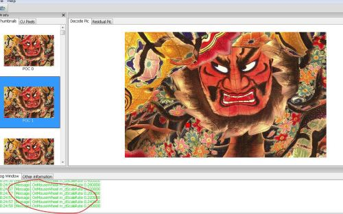
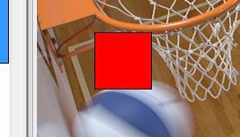

<!-- 
.. link: 
.. description: 
.. tags: wxWidgets,
.. date: 2013/06/08 14:40:02
.. title: wxWidgets自定义绘图控件
.. slug: wxWidgets-Custom-UI
-->

有时候系统提供的组件有可能不够你使用，比如我现在面临的显示YUV图像的控件，目前支持的功能是任意尺寸宏块或者CU的鼠标选定，鼠标拖拽确定范围，始终居中显示图片，鼠标滚轮翻页，ctrl加上滚轮放大或者缩小。

自定义wxControl第一步：

```CPP
class PicViewCtrl : public wxControl
{
public:
	DECLARE_DYNAMIC_CLASS(PicViewCtrl);
	//….
	DECLARE_EVENT_TABLE();
};
```

显示YUV图像:

```CPP
void PicViewCtrl::SetBitmap(wxBitmap bitmap)
{
    m_bClearFlag = false;
    m_cViewBitmap = bitmap;
    m_CtrlSize.SetWidth(m_dScaleRate*m_cViewBitmap.GetWidth());
    m_CtrlSize.SetHeight(m_dScaleRate*m_cViewBitmap.GetHeight());
    this->SetSizeHints(m_CtrlSize);
    GetParent()->FitInside();
    Refresh();
}
```

重写OnPaint和OnEraseBkg

```CPP
void PicViewCtrl::OnPaint(wxPaintEvent& event)
{
    wxPaintDC dc(this);
    Render(dc);
}
void PicViewCtrl::OnEraseBkg(wxEraseEvent& event)
{
    wxClientDC* clientDC = NULL;
    if (!event.GetDC())
        clientDC = new wxClientDC(this);
    wxDC* pDC = clientDC ? clientDC : event.GetDC();
    if(m_bClearFlag)
    {
        pDC->Clear();
        int w, height;
        wxSize size = GetClientSize();
        wxString s;
        s.Printf(_T("No picture to show!"), size.x, size.y);
        pDC->SetFont(*wxNORMAL_FONT);
        pDC->GetTextExtent(s, &w, &height);
        height += 3;
        pDC->SetBrush(*wxTRANSPARENT_BRUSH);
        pDC->SetPen(*wxLIGHT_GREY_PEN);
        pDC->DrawLine(0, 0, size.x, size.y);
        pDC->DrawLine(0, size.y, size.x, 0);
        pDC->DrawText(s, (size.x-w)/2, ((size.y-(height))/2));
        wxBitmap::CleanUpHandlers();
        return;
    }
    pDC->SetUserScale(m_dScaleRate, m_dScaleRate);
    if(m_cViewBitmap.IsOk())
        pDC->DrawBitmap(m_cViewBitmap, 0, 0, true);
    if(clientDC)
        delete clientDC;
}
```

Render负责画出选定的矩形方块

```CPP
void PicViewCtrl::Render(wxDC& dc)
{
    if(!m_bClearFlag)
    {
        dc.SetUserScale(m_dScaleRate, m_dScaleRate);
        dc.SetBrush(wxBrush(wxColor(255,0,0,128)));
        dc.DrawRectangle(m_curLCUStart, wxSize(m_curLCUEnd.x - m_curLCUStart.x, m_curLCUEnd.y - m_curLCUStart.y));
    }
}
```

在CSDN有关于MFC的两个函数的区别的讨论，现在摘录于下：

在MFC中任何一个window组件的绘图都是放在这两个member function中在设定上 OnEraseBkgnd()是用来画底图的而OnPaint()是用来画主要对象的

具体：[http://bbs.csdn.net/topics/320086198](http://bbs.csdn.net/topics/320086198)

ctrl加上滚轮放大或者缩小是使用了wxDC的SetUserScale，具体实现可以参考github中的[HEVCAnalyzer/PicViewCtrl.cpp](https://github.com/XimingCheng/HEVCAnalyzer/blob/master/HEVCAnalyzer/PicViewCtrl.cpp)

鼠标拖拽确定范围参考这里

[http://forums.wxwidgets.org/viewtopic.php?t=14575&highlight=onmousemove](http://forums.wxwidgets.org/viewtopic.php?t=14575&highlight=onmousemove)

最终效果：


其中的红色块会随着鼠标的移动而移动，默认设置是64x64大小，鼠标朝着蓝色方向拖动，滚轮会自动滚动，ctrl+滚轮放大缩小



出现的问题：

The background color of the LCU rectangle is solid in Windows(画刷的alpha透明色在WIN32和GTK之下没有效果)，红色矩形应该是半透明的：



Mac下面据说没有此问题，屌丝程序员，没有Mac机器测试。

WIN32后续解决方案：

The brush of the wxWidgets in Windows without GDIPlus enabled will not support the alpha channel, so rebuild the wxWidgets wxMSW with GDIPlus enabled is needed!
