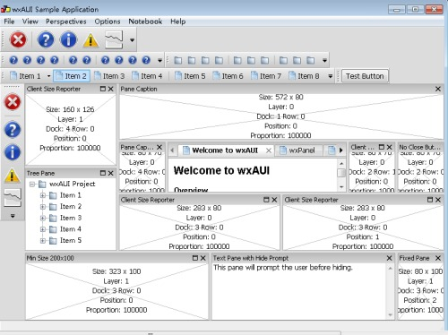

<!-- 
.. link: 
.. description: 
.. tags: wxWidgets,HEVC,Github Project
.. date: 2013/05/31 20:10:06
.. title: wxWidgets wxListCtrl与多线程UI更新
.. slug: wxWidgets-UI
-->

很久没有编写GUI程序了，还是在本科的时候经常编写MFC程序，现在觉得作为一个IT人士，必须每隔上一段时间学习新的技术，否则会被淘汰。所以，我看了看wxWidgets这个号称跨平台的GUI库。

主要的目标是实现一个HEVC的码流分析器（[HEVCAnalyzer](https://github.com/XimingCheng/HEVCAnalyzer)），这是一个长远的目标，估计要花上很长时间才能把功能完善，毕竟是我和一个同学在课余时间开发，而且目前遇到了很多的问题，我把这个星期我这方面遇到的问题总结一下，记录在此。

wxWidgets的使用我就不多说了，我的第一个目标就是编写一个YUV分析器，利用到了wxWidgets的AUI布局，下面是我的一个布局的草图：


关于AUI布局，他是一个高级的布局管理，其中包含的属性Layers, Rows and Directions, Positions可以控制子窗口的位置，官方给了一个例子，效果如下（个别布局被我修改过）



所以我开始给我的项目程序设计了成了这个样子：


其中左侧是YUV的缩率图列表使用了wxListCrtl，打开之后效果如下：


其中这里使用了多线程更新UI，主要是因为如果YUV文件过大，打开处理时间过长，用户会感觉UI被卡死。使用线程控制UI更新，但是线程里面不能直接更新UI，目前是使用自定义消息发给父窗口，父窗口处理列表的更新：

启动线程：

```CPP
if(m_pImage_list)
{
    delete m_pImage_list;
    m_pImage_list = NULL;
}
m_pImage_list = new wxImageList((int)m_iSourceWidth*scaleRate, (int)m_iSourceHeight*scaleRate);
m_pThumbnalList->SetImageList(m_pImage_list, wxIMAGE_LIST_NORMAL);
m_pThumbThread = new ThumbnailThread(this, m_pImage_list, m_iSourceWidth, m_iSourceHeight, bit, sfile);
if(m_pThumbThread->Create() != wxTHREAD_NO_ERROR)
{
    wxLogError(wxT("Can't create the thread!"));
    delete m_pThumbThread;
    m_pThumbThread = NULL;
}
else
{
    if(m_pThumbThread->Run() != wxTHREAD_NO_ERROR)
    {
        wxLogError(wxT("Can't create the thread!"));
        delete m_pThumbThread;
        m_pThumbThread = NULL;
    }
}
```

线程中处理YUV to RGB转换：

```CPP
void* ThumbnailThread::Entry()
{
    m_pImageList->RemoveAll();
    TVideoIOYuv cYUVIO;
    cYUVIO.open((char *)m_sYUVPath.mb_str(wxConvUTF8).data(), false, m_iYUVBit, m_iYUVBit, m_iYUVBit, m_iYUVBit);
    TComPicYuv* pcPicYuvOrg = new TComPicYuv;
    pcPicYuvOrg->create( m_iSourceWidth, m_iSourceHeight, 64, 64, 4 );
                                          
    wxBitmap bmp(m_iSourceWidth, m_iSourceHeight, 24);
    int frame = 0;
    while(!cYUVIO.isEof() && !TestDestroy())
    {
        int pad[] = {0, 0};
        cYUVIO.read(pcPicYuvOrg, pad);
        wxNativePixelData img(bmp);
        wxNativePixelData::Iterator p(img);
        for(int j = 0; j < m_iSourceHeight; j++)
        {
            wxNativePixelData::Iterator rowStart = p;
            Pel* pY = pcPicYuvOrg->getLumaAddr() + j*pcPicYuvOrg->getStride();
            Pel* pU = pcPicYuvOrg->getCbAddr()   + (j/2)*pcPicYuvOrg->getCStride();
            Pel* pV = pcPicYuvOrg->getCrAddr()   + (j/2)*pcPicYuvOrg->getCStride();
            for(int i = 0; i < m_iSourceWidth; i++)
            {
                // YUV to RBG转换
                //此处省略, 具体可以参见Github项目中详细处理
            }
            p = rowStart;
            p.OffsetY(img, 1);
        }
        //bmp.SaveFile(_("test.bmp"), wxBITMAP_TYPE_BMP);
        wxImage bimg = bmp.ConvertToImage();
        double scaleRate = 165.0/m_iSourceWidth;
        wxImage simg = bimg.Scale((int)m_iSourceWidth*scaleRate, (int)m_iSourceHeight*scaleRate);
        wxBitmap newbmp(simg);
        m_pImageList->Add(newbmp);
        wxCommandEvent event(wxEVT_ADDANIMAGE_THREAD, wxID_ANY);
        event.SetInt(frame);
        //m_pFrame->ProcessEvent(event);
        // this method can be used in Linux
        wxPostEvent(m_pFrame, event);
        frame++;
    }
                                          
    pcPicYuvOrg->destroy();
    delete pcPicYuvOrg;
    pcPicYuvOrg = NULL;
    wxCommandEvent event(wxEVT_END_THREAD, wxID_ANY);
    wxPostEvent(m_pFrame, event);
    return (wxThread::ExitCode)0;
}
```

自定义消息处理函数（父窗口）：

```CPP
void MainFrame::OnThreadAddImage(wxCommandEvent& event)
{
    int frame = event.GetInt();
//    wxString str;
//    str.Printf(wxT("frame %d added"), frame);
//    wxMessageBox(str);
    wxListItem item;
    item.SetId(frame);
    wxString text;
    text.Printf(wxT("POC %d"), frame);
    item.SetText(text);
    item.SetImage(frame);
    m_pThumbnalList->InsertItem(item);
}
```

遇到的问题:

1 Linux的wxThread估计有问题 ，无法启动线程


解决方法：

在wxApp的子类的构造函数添加线程初始化函数 XInitThreads();

```CPP
class HEVCodecApp : public wxApp
{
public:
#if defined(__UNIX__)
    HEVCodecApp()
    {
        XInitThreads();
    }
#endif
    bool OnInit();
};
```

参考 [http://forums.wxwidgets.org/viewtopic.php?t=32346&p=139431](http://forums.wxwidgets.org/viewtopic.php?t=32346&p=139431)

2 wxListCtrl在Linux下面显示有问题，无法单列显示列表，这个是wxWidgets 2.8.12的bug，其例子也有这个bug：


我们打算使用wxHTMLListBox来解决这个bug


